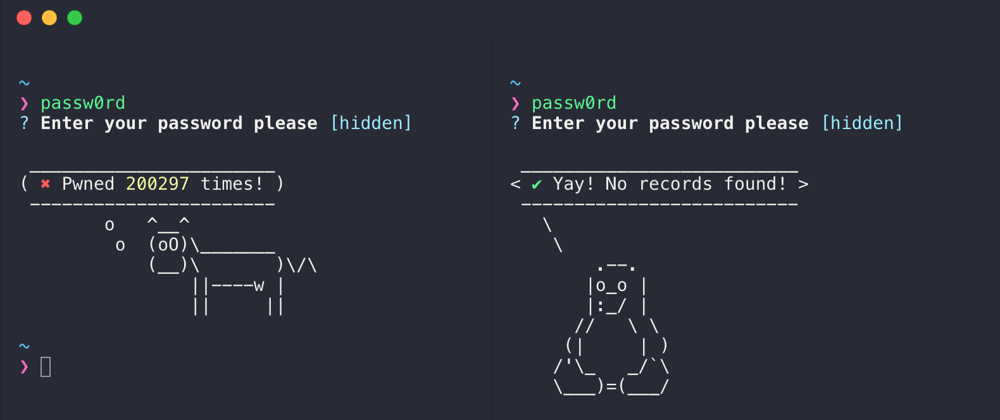

# passw0rd [![travis][travis-image]][travis-url] [![npm][npm-image]][npm-url] [![XO code style][xo-image]][xo-url]

[travis-image]: https://img.shields.io/travis/djadmin/passw0rd/master.svg
[travis-url]: https://travis-ci.org/djadmin/passw0rd
[npm-image]: https://img.shields.io/npm/v/passw0rd.svg
[npm-url]: https://npmjs.org/package/passw0rd
[xo-image]: https://img.shields.io/badge/code_style-XO-5ed9c7.svg
[xo-url]: https://github.com/xojs/xo

🔑 securely checks a password to see if it has been previously exposed in a data breach

## CLI 💻

* Keeps your password hidden
* Clears your clipboard automatically

### Installation 🚀

Ensure you have Node.js version 5 or higher installed. Then run the following:

```$ npm install --global passw0rd```

### Checking your password 🔍

```$ passw0rd```



## API 📝

### Installation

```$ npm install passw0rd```

### Usage

```js
const passw0rd = require('passw0rd');

passw0rd.check('passw0rd').then(res => {
	console.log(`Password was found ${res.count} times`);
});
```

**Browser**

Run the following command to get [UMD](https://github.com/umdjs/umd) version of the library under the `dist` folder

`$ npm run build`

```html
<script src="https://cdn-path/dist/passw0rd.js"></script>
```
You can find the library on `window.passw0rd`. A very simple POC is available at [browser.html](./browser.html)

## How it works ⚙

[Pwned Passwords](https://www.troyhunt.com/ive-just-launched-pwned-passwords-version-2/) has implemented a k-Anonymity model that allows a password to be searched for by partial hash. This allows the first 5 characters of a SHA-1 password hash (not case-sensitive) to be passed to the API.

`GET https://api.pwnedpasswords.com/range/{first 5 hash chars}`

**passw0rd** is using [Pwned Passwords API](https://haveibeenpwned.com/API/v2#PwnedPasswords) which searches through a database of more than 500 million passwords collected from various breaches.

## Todo

* Add CLI Help Menu
* Add Icon / GIF
* Add babel
* Reduce bundle size using webpack
* Write unit test cases
* Improve performance for browser api
* Improve browser POC
* Move cli/lib to a different repo
* Add security checks
* Add to node-awesomejs

## FAQ - Why is it named passw0rd? 💫

> `passw0rd` is one of the most commonly used passwords and has been found 200297 times in various data breaches!

## See Also

* Active Directory - [Checking for Breached Passwords in Active Directory](https://jacksonvd.com/checking-for-breached-passwords-ad-using-k-anonymity/)
* 1Password - [Check your 1password exported passwords](https://github.com/eblin/1passpwnedcheck)

## License

MIT © [Dheeraj Joshi](https://djadmin.in)
